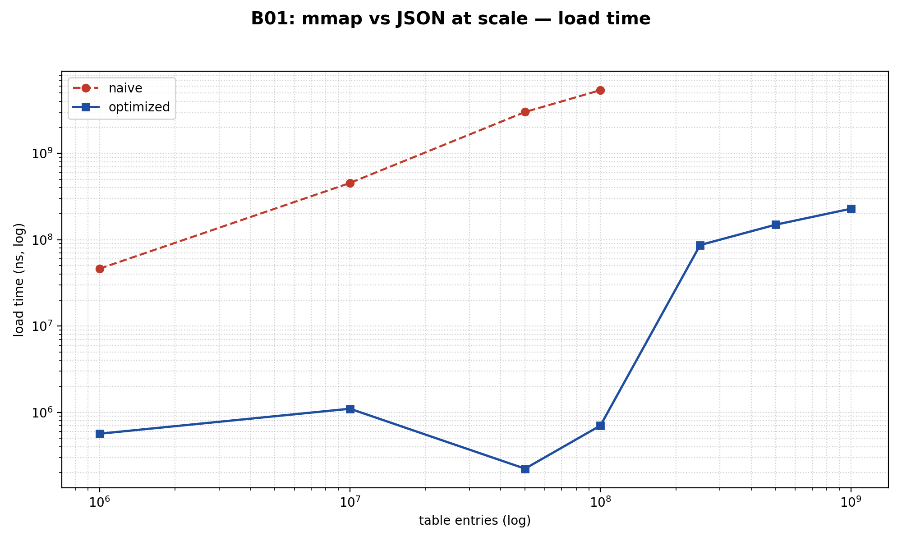
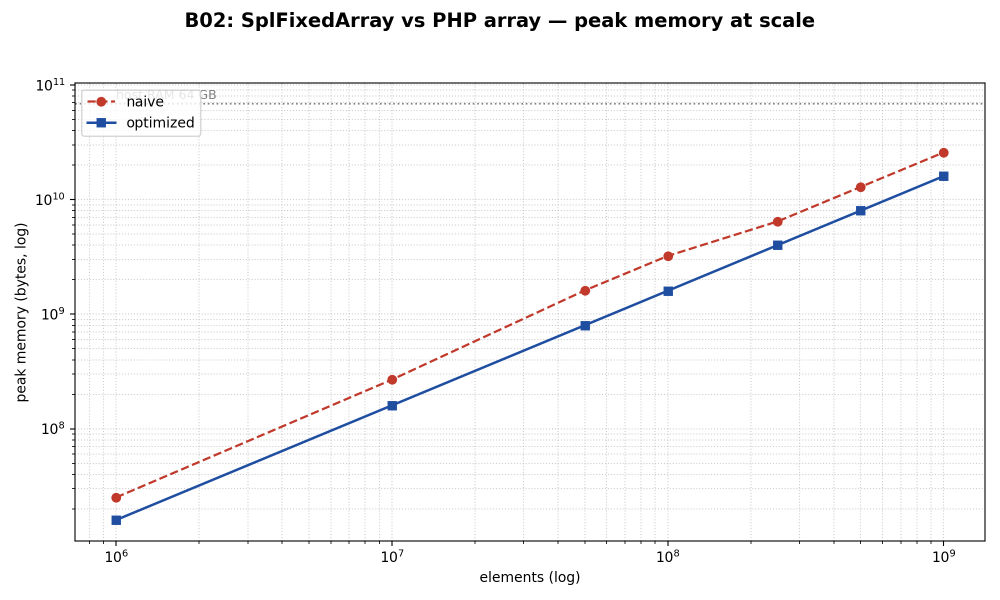
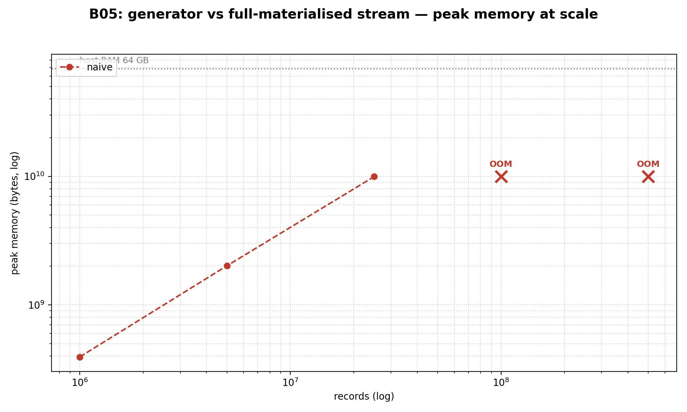
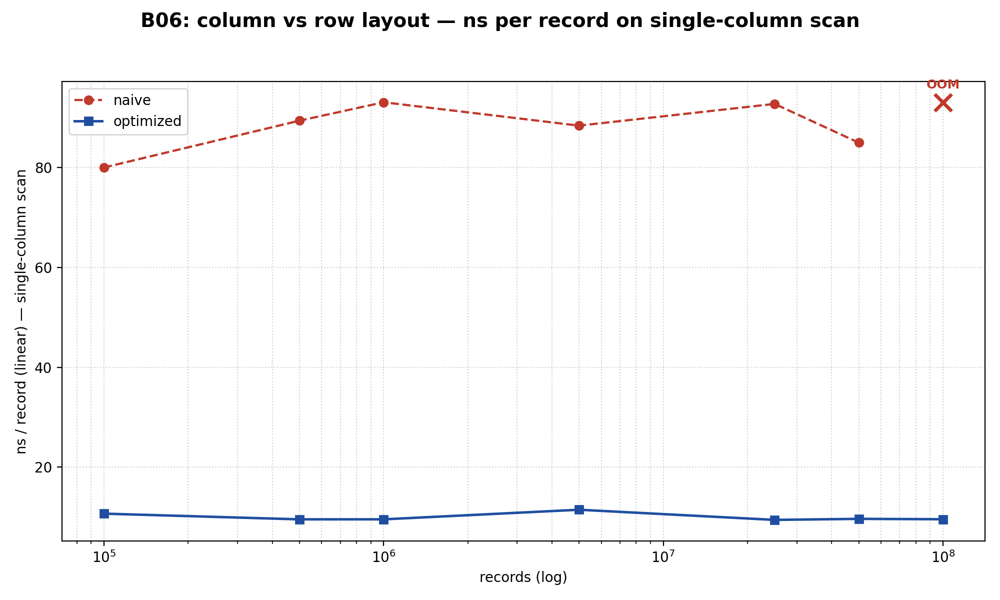

# Scaling Experiments

Each row is one PHP subprocess: `php -d memory_limit=60G bin/scale-worker.php ...`.
Hard timeout: 1200 s. Statuses: `ok`, `OOM` (PHP fatal or kernel SIGKILL),
`TIMEOUT` (we sent SIGTERM/SIGKILL after 1200 s), `CRASH` (non-zero exit, other).

## B01

| Scale | n | naive load | naive heap | naive p99 lookup | mmap load | mmap heap | mmap p99 lookup |
|-------|---:|-----------:|-----------:|-----------------:|----------:|----------:|----------------:|
| 1M | 1,000,000 | 46.16 ms | 16.00 MB | 250 ns | 565.38 µs | 0 B | 250 ns |
| 10M | 10,000,000 | 454.29 ms | 256.00 MB | 708 ns | 1.10 ms | 0 B | 5.42 µs |
| 50M | 50,000,000 | 3.018 s | 1.00 GB | 334 ns | 222.46 µs | 0 B | 284.17 µs |
| 100M | 100,000,000 | 5.406 s | 2.00 GB | 417 ns | 703.00 µs | 0 B | 323.29 µs |
| 250M | 250,000,000 | **SKIPPED** | **SKIPPED** | **SKIPPED** | 86.75 ms | 0 B | 512.38 µs |
| 500M | 500,000,000 | **SKIPPED** | **SKIPPED** | **SKIPPED** | 149.16 ms | 0 B | 539.88 µs |
| 1B | 1,000,000,000 | **SKIPPED** | **SKIPPED** | **SKIPPED** | 228.55 ms | 0 B | 309.17 µs |

**Crossover point:** at **250M** fixture too large to materialise as JSON; only optimized path runs.

## B02

| Scale | n | naive peak | naive populate | naive iterate | SFA peak | SFA populate | SFA iterate |
|-------|---:|----------:|---------------:|--------------:|---------:|-------------:|------------:|
| 1M | 1,000,000 | 24.01 MB | 5.19 ms | 1.27 ms | 15.26 MB | 10.76 ms | 10.09 ms |
| 10M | 10,000,000 | 256.00 MB | 56.54 ms | 12.23 ms | 152.59 MB | 108.77 ms | 93.80 ms |
| 50M | 50,000,000 | 1.50 GB | 261.18 ms | 60.33 ms | 762.94 MB | 527.42 ms | 482.20 ms |
| 100M | 100,000,000 | 3.00 GB | 538.56 ms | 120.30 ms | 1.49 GB | 1.051 s | 948.60 ms |
| 250M | 250,000,000 | 6.00 GB | 1.274 s | 295.21 ms | 3.73 GB | 2.583 s | 2.384 s |
| 500M | 500,000,000 | 12.00 GB | 3.109 s | 630.22 ms | 7.45 GB | 5.412 s | 5.037 s |
| 1B | 1,000,000,000 | 24.00 GB | 8.776 s | 1.507 s | 14.90 GB | 11.761 s | 9.733 s |

**Crossover point:** none observed within the sweep — naive path completed every tier.

## B05

| Scale | n | naive peak | naive wall | gen peak | gen wall |
|-------|---:|----------:|-----------:|---------:|---------:|
| 1M | 1,000,000 | 376.00 MB | 104.00 ms | 0 B | 87.98 ms |
| 5M | 5,000,000 | 1.88 GB | 525.26 ms | 0 B | 449.05 ms |
| 25M | 25,000,000 | 9.27 GB | 3.379 s | 0 B | 2.192 s |
| 100M | 100,000,000 | **OOM** | **OOM** | 0 B | 10.439 s |
| 500M | 500,000,000 | **OOM** | **OOM** | 0 B | 45.680 s |

**Crossover point:** at **100M** the naive path OOM; optimized path still completes.

## B06

| Scale | n | row peak | row scan | row ns/rec | col peak | col scan | col ns/rec |
|-------|---:|--------:|---------:|-----------:|---------:|---------:|-----------:|
| 100K | 100,000 | 42.00 MB | 8.00 ms | 79.96 | 10.00 MB | 1.07 ms | 10.72 |
| 500K | 500,000 | 211.63 MB | 44.67 ms | 89.33 | 38.16 MB | 4.79 ms | 9.57 |
| 1M | 1,000,000 | 423.26 MB | 93.02 ms | 93.02 | 76.31 MB | 9.58 ms | 9.58 |
| 5M | 5,000,000 | 2.09 GB | 441.70 ms | 88.34 | 381.48 MB | 57.49 ms | 11.50 |
| 25M | 25,000,000 | 10.39 GB | 2.317 s | 92.69 | 1.86 GB | 236.68 ms | 9.47 |
| 50M | 50,000,000 | 20.79 GB | 4.246 s | 84.92 | 3.73 GB | 483.72 ms | 9.67 |
| 100M | 100,000,000 | **OOM** | **OOM** | **OOM** | 7.45 GB | 959.53 ms | 9.60 |

**Crossover point:** at **100M** the naive path OOM; optimized path still completes.

